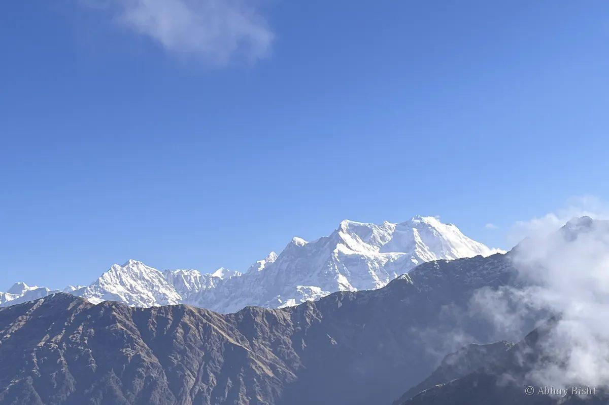
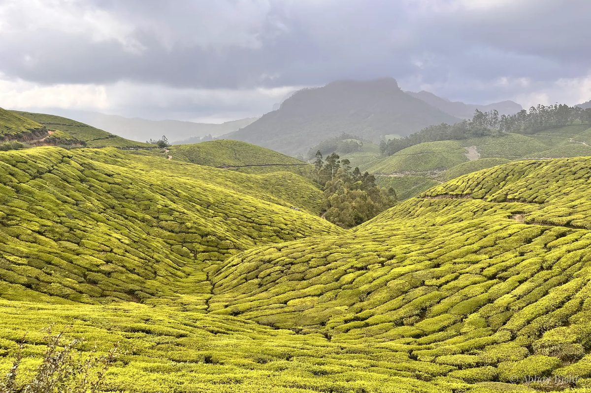
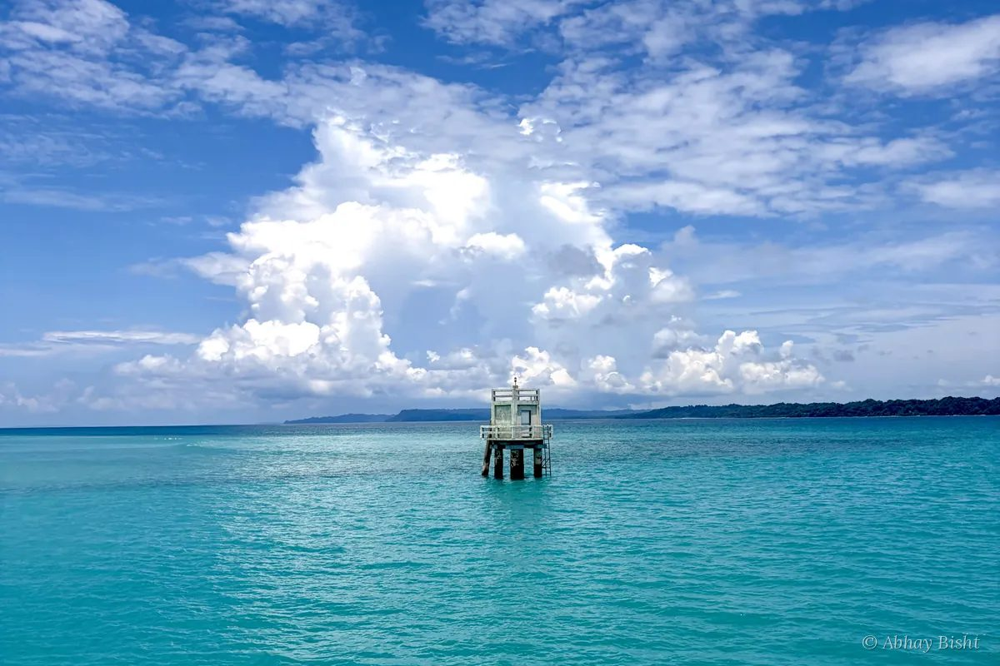
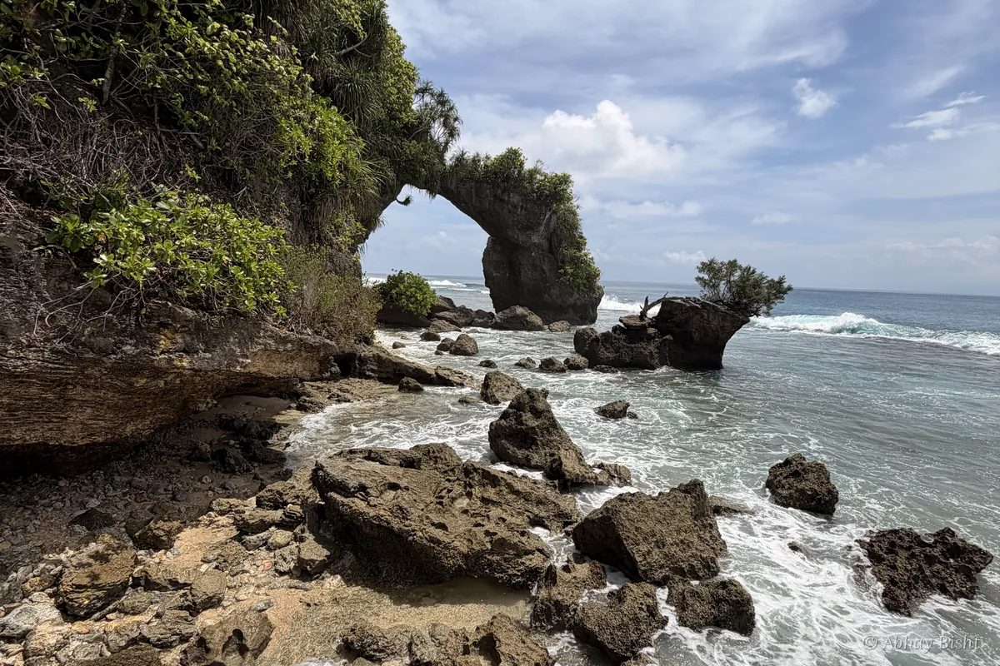
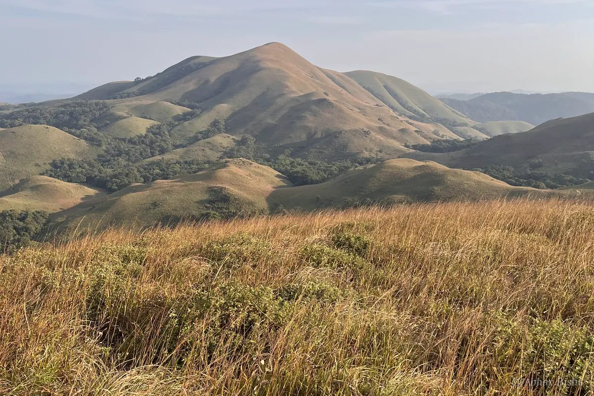
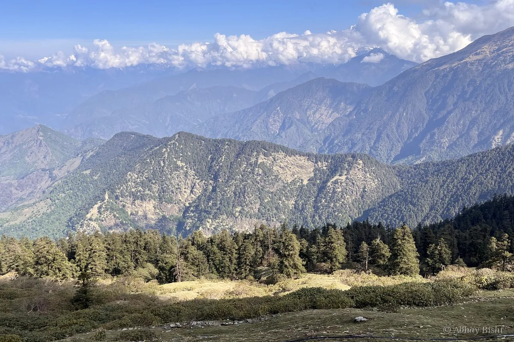

<h1 align="center">Abhay Bisht</h1>

  <b>GenAI full-stack engineer</b>

  
  
  

<table>
  <tr>
    <td width="33%"></td>
    <td width="33%"></td>
    <td width="33%"></td>
  </tr>
  <tr>
    <td width="33%"></td>
    <td width="33%"></td>
    <td width="33%"></td>
  </tr>
</table>

### What I do

I build AI products end to end: agentic workflows, LLM and RAG pipelines, and the full-stack apps around them, from the first prompt to production. 3+ years shipping across seven teams.

### Things I've shipped

| Product | What I built |
|---|---|
| **[Genios AI](https://geniosai.co/)** | Agentic AI for Wall Street (current) |
| **[Tario.ai](https://www.tario.ai/)** · Zycus | AI SDR platform: parallel dialing, call analysis, RAG-powered outreach |
| **[Jeeves](https://www.314e.com/jeeves/)** · 314e | Just-in-time EHR training: screen recorder, annotation editor |
| **[Gappy.ai](https://www.gappy.ai/)** | Copilot SDK and dashboards for agents, tools and knowledge graphs |
| **[SuperNeuro.ai](https://github.com/iabhaybisht/SuperNeuro-ai)** | RAG, custom agents and tool calling in one platform |
| **[Wintrace.ai](https://wintrace-ai-ui.onrender.com/)** | Turns daily reflection into measurable execution |

Off the clock I'm usually chasing a sunrise somewhere. Photos © Abhay Bisht.

